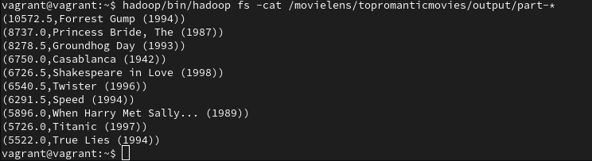

# Large Scale Data Management Systems

## Setup
In order to be able to use Spark easily, inside the hua-spark project there is a Vagrant script.<br />
This script will create a VM with Spark 3.2.0 running on Ubuntu 12.04.2 LTS. <br />
Linux workstation is required.<br />
Inside the VM, a folder names /vagrant/ refers to the folder /hua-spark/.<br />

This folder is used in order to exchange files, movies.dat and ratings.dat in our case,<br />
between our machine and the VM.<br />

In case you have already installed a single Spark node running on a single-node Hadoop <br />
HDFS filesystem, you don't have to set up our VM.<br />

## How to run
```bash
1. Please make sure that you have installed java 11 and maven in your system.
2. Open the pom project
3. Maven clean install the project
4. Open terminal
5. cd hua-spark
6. vagrant up
7. vagrant ssh
8. hadoop/sbin/start-dfs.sh
9. spark/sbin/start-all.sh
10. hadoop/bin/hadoop fs -mkdir -p /movielens/movies/input
11. hadoop/bin/hadoop fs -mkdir -p /movielens/ratings/input
12. hadoop/bin/hadoop fs -put /vagrant/data/hua-spark-java/movielens/movies.dat /movielens/movies/input
13. hadoop/bin/hadoop fs -put /vagrant/data/hua-spark-java/movielens/ratings.dat /movielens/ratings/input
14. spark/bin/spark-submit --class hua.rdd.MostRatedMovies /vagrant/data/hua-spark-java/target/hua-spark-java-1.0-SNAPSHOT.jar hdfs://localhost:54310/movielens/movies/input hdfs://localhost:54310/movielens/ratings/input hdfs://localhost:54310/movielens/mostratedmovies/output
15. hadoop/bin/hadoop fs -cat /movielens/mostratedmovies/output/part-*
16. spark/bin/spark-submit --class hua.rdd.GoodComedyMovies /vagrant/data/hua-spark-java/target/hua-spark-java-1.0-SNAPSHOT.jar hdfs://localhost:54310/movielens/movies/input hdfs://localhost:54310/movielens/ratings/input hdfs://localhost:54310/movielens/goodcomedymovies/output
17. hadoop/bin/hadoop fs -cat /movielens/goodcomedymovies/output/part-*
18. spark/bin/spark-submit --class hua.rdd.TopRomanticMovies /vagrant/data/hua-spark-java/target/hua-spark-java-1.0-SNAPSHOT.jar hdfs://localhost:54310/movielens/movies/input hdfs://localhost:54310/movielens/ratings/input hdfs://localhost:54310/movielens/topromanticmovies/output
19. hadoop/bin/hadoop fs -cat /movielens/topromanticmovies/output/part-*
20. spark/bin/spark-submit --class hua.dataframe.DfMostRatedMovies /vagrant/data/hua-spark-java/target/hua-spark-java-1.0-SNAPSHOT.jar hdfs://localhost:54310/movielens/movies/input hdfs://localhost:54310/movielens/ratings/input hdfs://localhost:54310/movielens/dfmostratedmovies/output
21. hadoop/bin/hadoop fs -cat /movielens/dfmostratedmovies/output/part-*
22. spark/bin/spark-submit --class hua.dataframe.DfGoodComedyMovies /vagrant/data/hua-spark-java/target/hua-spark-java-1.0-SNAPSHOT.jar hdfs://localhost:54310/movielens/movies/input hdfs://localhost:54310/movielens/ratings/input hdfs://localhost:54310/movielens/dfgoodcomedymovies/output
23. hadoop/bin/hadoop fs -cat /movielens/dfgoodcomedymovies/output/part-*
24. spark/bin/spark-submit --class hua.dataframe.DfTopRomanticMovies /vagrant/data/hua-spark-java/target/hua-spark-java-1.0-SNAPSHOT.jar hdfs://localhost:54310/movielens/movies/input hdfs://localhost:54310/movielens/ratings/input hdfs://localhost:54310/movielens/dftopromanticmovies/output
25. hadoop/bin/hadoop fs -cat /movielens/dftopromanticmovies/output/part-*
26. spark/bin/spark-submit --class hua.dataframe.DfMostRatedOnDecember /vagrant/data/hua-spark-java/target/hua-spark-java-1.0-SNAPSHOT.jar hdfs://localhost:54310/movielens/movies/input hdfs://localhost:54310/movielens/ratings/input hdfs://localhost:54310/movielens/dfmostratedondecember/output
27. hadoop/bin/hadoop fs -cat /movielens/dfmostratedondecember/output/part-*
```

## Explained
After starting hadoop/sbin and spark/sbin we create 2 folders, <br/ >
/movielens/movies/input and /movielens/ratings/input.

These are the movies and ratings dataset in plain text format.<br />
In the next step we run every main class, passing 3 arguments,<br />
the first 2 are the movies.dat and ratings.dat and the 3rd argument is the output.
Then we -cat the out folder, in order to see the results.

In case you need to remove an output folder please use, <br />
```bash
hadoop/bin/hadoop fs -rm -r "output-folder"
```

## Caching
We did not apply any caching, since every query has its own Class.
If We had to use every part in one Class, We should have cached the inner join between movieId from movies and ratings dataset.

## Proof it works
## Part 1 RDD
Top 25 most rated movies


all comedy movies been rated >= 3


Top 10 romance movies based on December rating


##Part 2 Dataframes API
Top 25 most rated movies


all comedy movies been rated >= 3


Top 10 romance movies based on December rating


All movies that most users rated on December


## Credits
Some links that We'd like to give some credits.

[https://spark.apache.org/docs/latest/sql-data-sources-text.html](https://spark.apache.org/docs/latest/sql-data-sources-text.html)<br />
[https://spark.apache.org/docs/latest/sql-getting-started.html#creating-datasets](https://spark.apache.org/docs/latest/sql-getting-started.html#creating-datasets)<br />
[https://spark.apache.org/docs/2.1.0/api/java/org/apache/spark/sql/Dataset.html](https://spark.apache.org/docs/2.1.0/api/java/org/apache/spark/sql/Dataset.html)<br />
[https://stackoverflow.com/questions/38931892/how-to-read-text-file-and-convert-it-to-a-dataset-in-java-spark](https://stackoverflow.com/questions/38931892/how-to-read-text-file-and-convert-it-to-a-dataset-in-java-spark)<br />
[https://stackoverflow.com/questions/63572210/how-spark-handles-out-of-memory-error-when-cached-memory-only-persistence-data](https://stackoverflow.com/questions/63572210/how-spark-handles-out-of-memory-error-when-cached-memory-only-persistence-data)<br />
[https://stackoverflow.com/questions/64035234/can-i-use-java-time-localdate-in-spark-dataframe-udf](https://stackoverflow.com/questions/64035234/can-i-use-java-time-localdate-in-spark-dataframe-udf)<br />
[https://stackoverflow.com/questions/34409875/how-to-get-other-columns-when-using-spark-dataframe-groupby?rq=1](https://stackoverflow.com/questions/34409875/how-to-get-other-columns-when-using-spark-dataframe-groupby?rq=1)<br />
[https://stackoverflow.com/questions/41479072/how-to-get-all-columns-after-groupby-on-datasetrow-in-spark-sql-2-1-0/41483738](https://stackoverflow.com/questions/41479072/how-to-get-all-columns-after-groupby-on-datasetrow-in-spark-sql-2-1-0/41483738)<br />
[https://stackoverflow.com/questions/53852194/join-aggregate-then-select-specific-columns-in-apache-spark](https://stackoverflow.com/questions/53852194/join-aggregate-then-select-specific-columns-in-apache-spark)<br />
[https://stackoverflow.com/questions/21138751/spark-java-lang-outofmemoryerror-java-heap-space](https://stackoverflow.com/questions/21138751/spark-java-lang-outofmemoryerror-java-heap-space)<br />